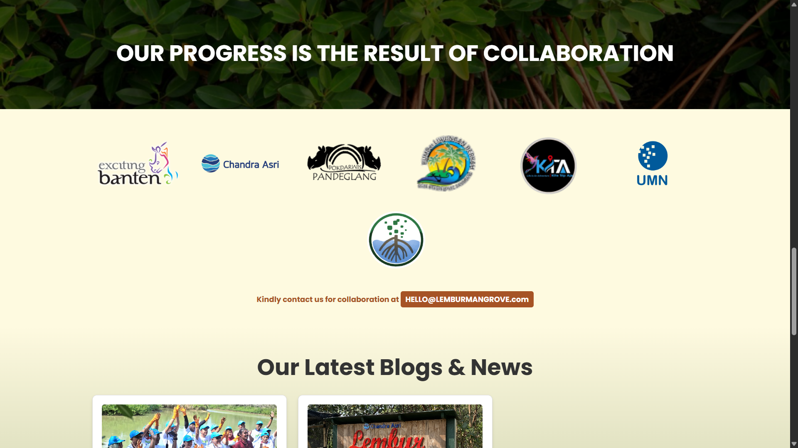
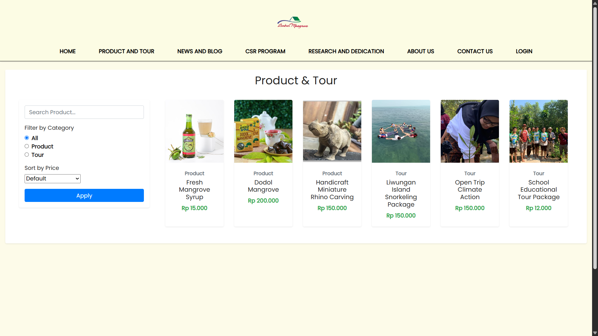
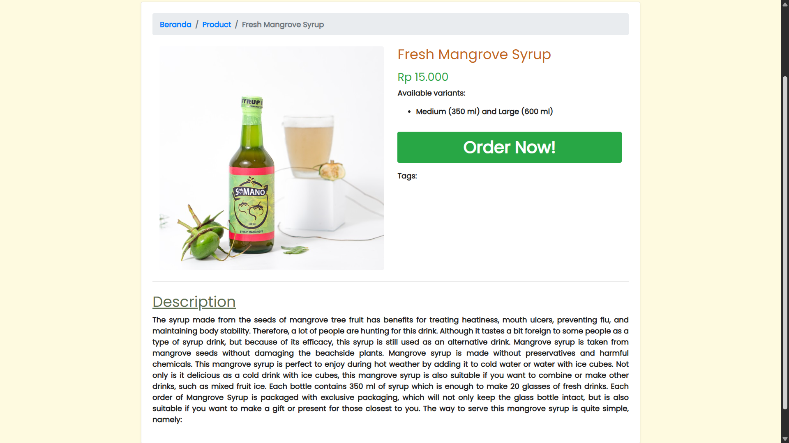
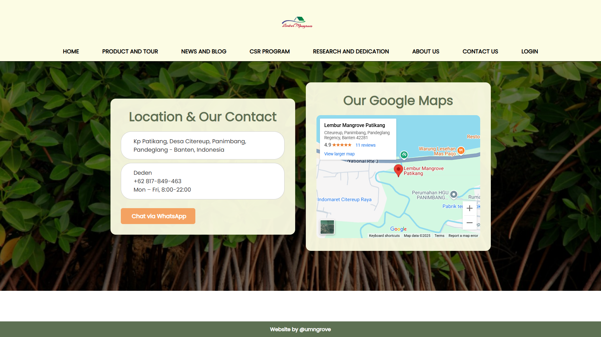

# UMNGrove - Lembur Mangrove Patikang Website V.1.0

### 🌿 **Empowering Communities Through Mangrove Conservation**

---

## 📋 **Table of Contents**
1. [Project Overview](#-project-overview)
2. [Features](#-features)
3. [Technology Stack](#️-technology-stack)
4. [Installation and Setup](#️-installation-and-setup)
5. [Project Architecture](#️-project-architecture)
6. [User Roles and Access](#-user-roles-and-accesss)
7. [Contribution Guidelines](#-contribution-guidelines)
8. [Roadmap](#-roadmap)
9. [Screen Shots](#-screen-shot)
10. [Special Thanks](#-special-thanks)
11. [License](#license)
---

## 📖 **Project Overview**

The **Lembur Mangrove Patikang Website** is part of the **International Community Outreach Program** by Universitas Multimedia Nusantara (UMN), aimed at revitalizing the mangrove conservation initiative in Banten, Indonesia. This non-profit project is in collaboration with Multimedia University Malaysia and Jilin University, Hong Kong, funded by LPPM UMN.

The website serves as a platform to:
- Promote eco-tourism.
- Support local economic empowerment.
- Foster environmental sustainability.

### 🌟 **Goals**
- Enhance community awareness of mangrove conservation.
- Provide a professional and user-friendly platform for tourism and product promotion.
- Support sustainable development through education and community engagement.

---

## 🌟 **Features**

- **Home Page**: Dynamic insights into eco-tourism, products, and mangrove benefits.
- **About Us**: Highlights the initiative's mission, vision, and contributors.
- **Category Pages**:
  - **Contact**: Easy access to reach out to the team.
  - **Payment Gateway**: Simplified booking and donation process.
  - **Products and Tours**: Details on local goods and eco-tourism activities.
  - **News & Blogs**: Updates on conservation efforts and local stories.
  - **Visitor Indicators**: Real-time statistics on engagement and visits.
- **User Management**:
  - **Admin**: Comprehensive control of the site.
  - **Members**: Personalized dashboard and content creation tools.
  - **Guests**: Limited access to browse content and learn about the initiative.

---

## 🛠️ **Technology Stack**

- **Frontend**: 
  - HTML, CSS, JavaScript, Bootstrap 5.3 
- **Backend**: 
  - PHP 
- **Framework**:
  - Laravel 7
- **Database**: 
  - MySQL
- **Architecture**: 
  - MVC (Model View Controller)
- **Design Tool**: 
  - Figma (for UI/UX mockups)

---

## ⚙️ **Installation and Setup**

### Prerequisites
1. PHP (>=7.3)
2. Composer
3. Node.js and npm
4. MySQL

### Steps
1. Clone the repository:
   ```bash
   git clone https://github.com/UMNGrove/website.git
   ```
2. Navigate to the project directory:
   ```bash
   cd website
   ```
3. Install dependencies:
   ```bash
   composer install
   npm install
   ```
4. Set up the environment:
   - Create a `.env` file based on `.env.example`.
   - Configure your database credentials.
5. Run migrations and seed the database:
   ```bash
   php artisan migrate --seed
   ```
6. Start the development server:
   ```bash
   php artisan serve
   ```
7. Access the site at `http://localhost:8000`.

---

## 🏗️ **Project Architecture**
The project follows the Model-View-Controller (MVC) architecture:

- **Model**: Manages application data and business logic.
- **View**: Handles UI rendering with Laravel Blade templates.
- **Controller**: Bridges the Model and View for smooth user interactions.

---

## 👤 **User Roles and Access**

### **Admin**
- Manage users, content, and categories.
- View analytics and visitor statistics.

### **Member**
- Create and manage posts.
- Edit personal profiles.

### **Guest**
- Browse available content and learn about the program.

---

## 🤝 **Contribution Guidelines**

We welcome contributions from the community! Follow these steps:
1. Fork the repository.
2. Create a new branch for your feature or bug fix:
   ```bash
   git checkout -b feature-name
   ```
3. Commit your changes:
   ```bash
   git commit -m "Description of changes"
   ```
4. Push the changes:
   ```bash
   git push origin feature-name
   ```
5. Open a pull request, and the team will review it.

---

## 📈 **Roadmap**
**Upcoming Features**
- Multi-language Support (Bahasa Indonesia & English)

---
## 📷 **Screen Shot**
### Home Page (Non-Login)





### About US (Non-Login)



### Contact US (Non-Login)


### Product and Tour


### News and Blog 




### CSR


### Research and Dedication


### Login Page


### Sign Up

---
## 🌟 **Special Thanks**
We extend our gratitude to the following contributors and partners:
- **Project Leader**: Lovenia Megumi Surjanto
- **Public Relations**: Imel Sausan Maryam, Winsten, Christabell Grace Chalin
- **Event Coordinators**: Angel Tambarna Teresa, Rafael Putra Hulu
- **Visuals**: Maitriana, Luna Ardhagia Widodo
- **Social Media**: Cindy Celia Jennifer, Kezia Margaretha Chandra
- **Developers**:
  - Fullstack: Jeremy Ansellino Gunawan
  - Frontend: Aldo Juan Edrick Jolin, Ivan Reynardo
  - Backend: Edward
- **Videography**: Evelyn Valencia

---

## 📜**License**
This project is licensed under the MIT License - see the [LICENSE](LICENSE) file for details.
